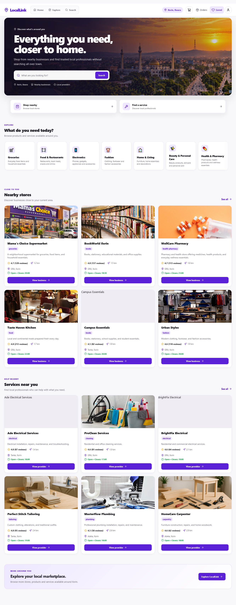
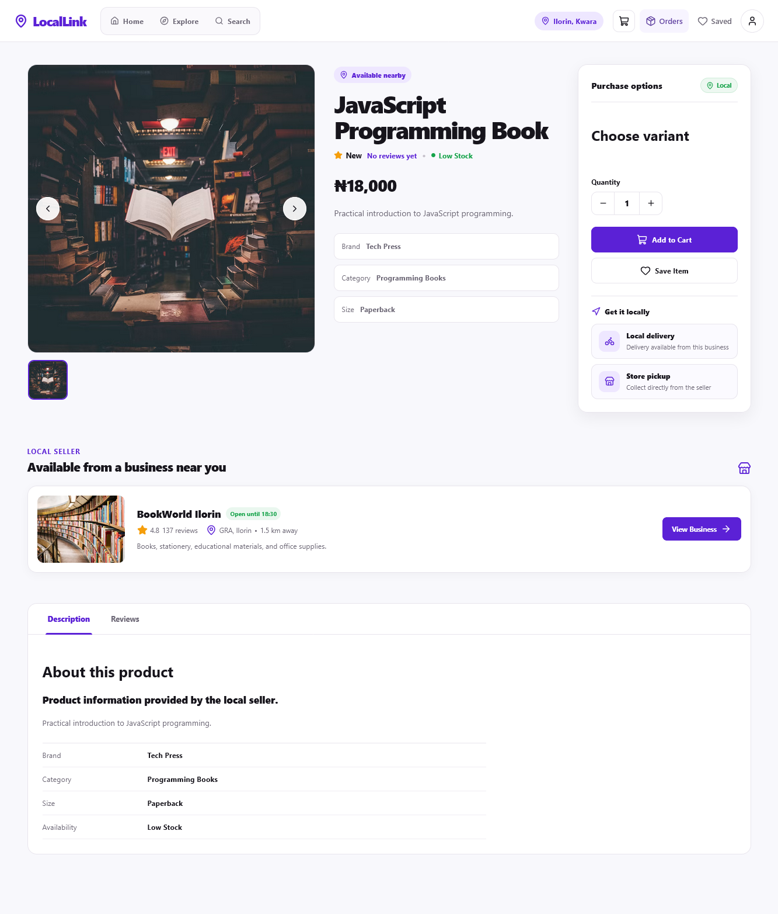
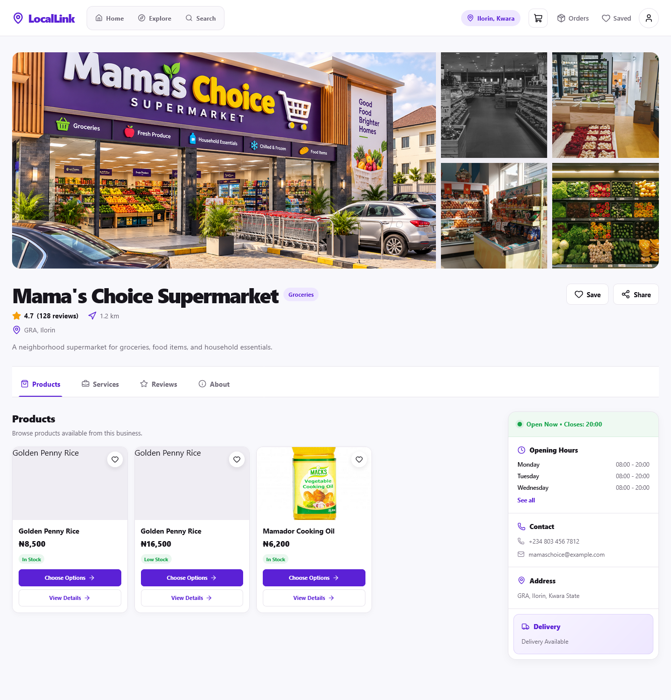
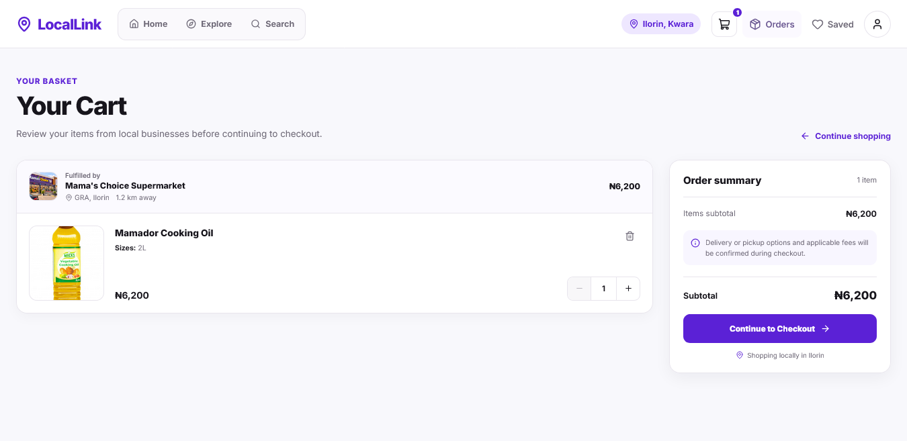
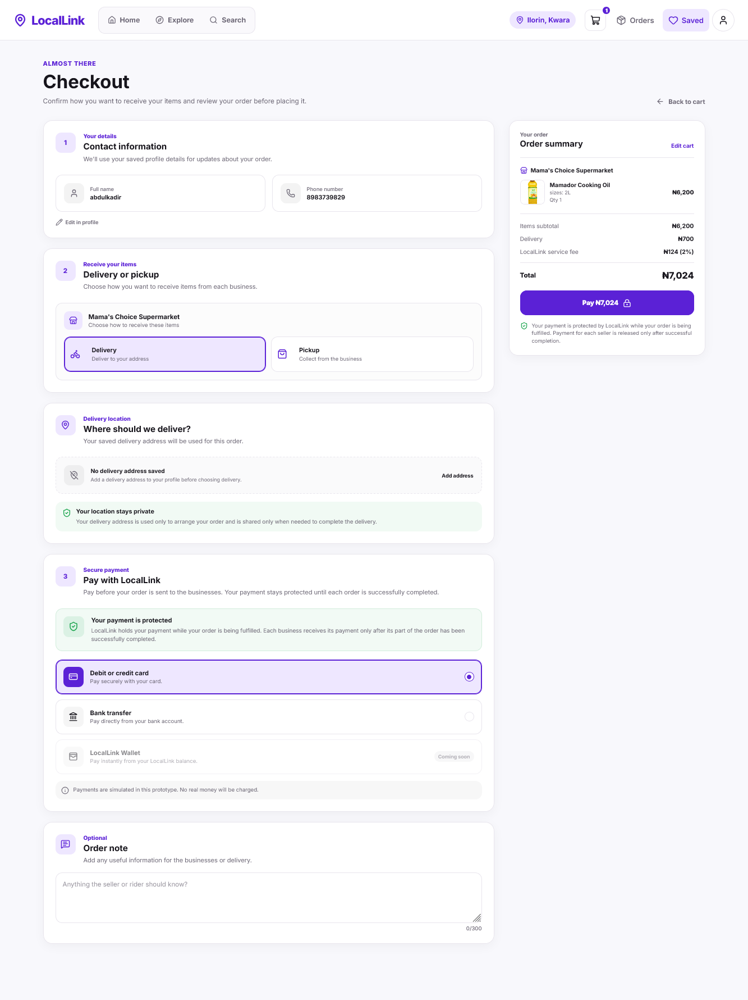
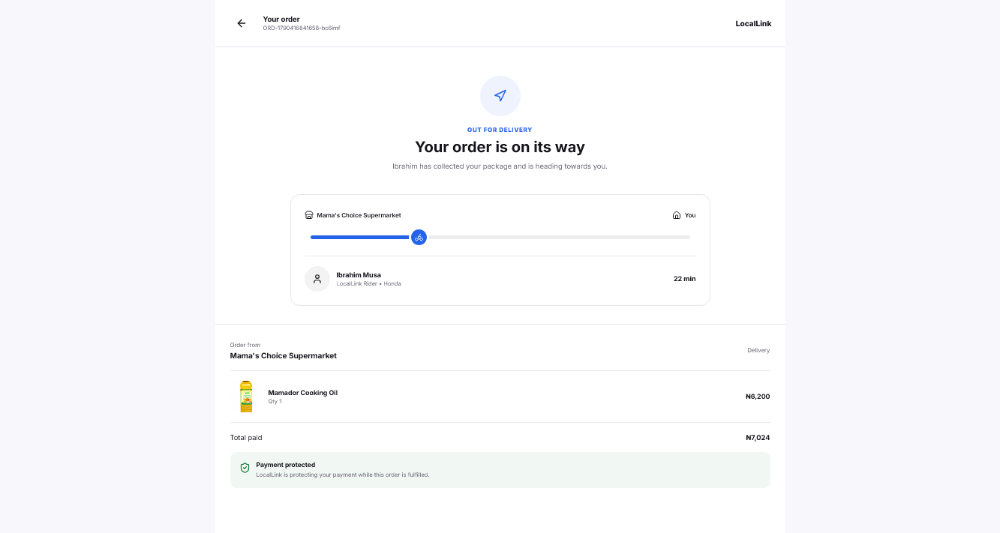
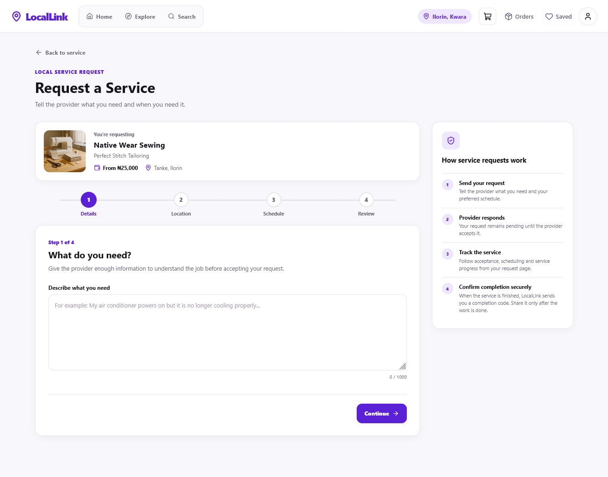
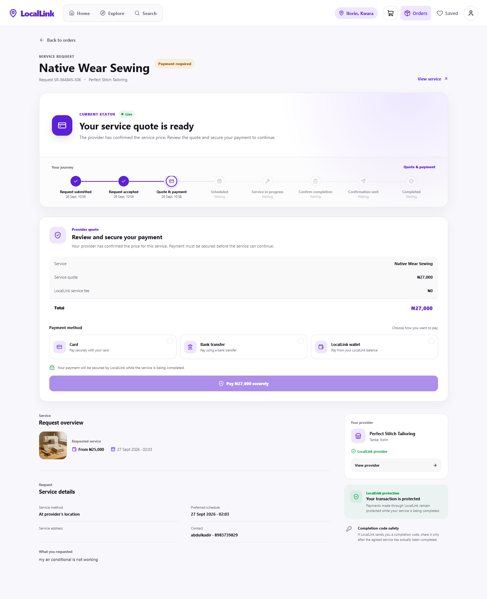

# LocalLink

LocalLink is a local commerce marketplace prototype designed to help people discover and interact with nearby businesses and service providers from one platform.

The project explores a location-focused marketplace experience where users can browse local stores, discover products, find service providers, place orders, request services, save items, and track their activities through a simple and modern interface.

> **Project Status:** Frontend prototype. The current version uses static JavaScript data and browser storage to simulate application behaviour. A production backend, authentication system, payment infrastructure, real-time location services, and provider/seller applications are not yet implemented.

## Live Demo

The current frontend prototype is deployed with GitHub Pages.

**[View the Live LocalLink Prototype](https://devabdul-web.github.io/locallink-prototype/)**

The deployment demonstrates the current customer-side marketplace experience, including product discovery, business profiles, cart and checkout flows, order tracking, service discovery, service requests, and simulated service tracking.

## Overview

Local commerce is often fragmented. Customers may know that a product or service exists somewhere nearby but still have difficulty answering questions such as:

- Which nearby store sells what I need?
- How much does it cost?
- Which service providers operate around me?
- What services do they provide?
- Can I request the service at my location?
- Can I compare nearby options before making a decision?

LocalLink is being designed around that problem.

The broader vision is to create a location-aware marketplace connecting four major participants:

**Customers** — discover products, stores, and services nearby.

**Sellers** — make their stores and products discoverable to local customers.

**Service Providers** — list services and receive requests from nearby customers.

**Delivery Partners** — support local delivery between businesses and customers.

The current prototype focuses primarily on demonstrating the **customer experience**.

## Screenshots

### Marketplace Home

The main LocalLink interface provides a starting point for discovering nearby businesses, products, and services.



### Product Discovery

Users can open individual products to view product information, pricing, availability, variants, and the business selling the product.



### Business Profile

Businesses have dedicated profiles where customers can view business information and explore the products offered by that seller.



### Cart and Checkout

Products can be added to a persistent shopping cart before the customer proceeds through the simulated checkout flow.





### Order Tracking

After checkout, the prototype simulates the progression of an order through different fulfilment states.



### Service Requests

LocalLink also supports service-based transactions. Customers can submit a request based on the selected service and its fulfilment options.



### Service Tracking

Service requests have their own simulated lifecycle, including status progression and OTP-based completion confirmation.



## Current Prototype Features

### Local Discovery

Users can explore businesses, products, and service providers through a marketplace-style interface.

The prototype contains sample local businesses and providers with information such as location, distance, ratings, availability, products, services, and business details.

### Product Marketplace

Users can:

- Browse products
- Search for products
- Explore product categories
- View individual product details
- View the business selling a product
- Select available product variants
- Add products to the cart
- Update quantities
- Remove products from the cart
- Save products for later

### Business Profiles

Each business can have a dedicated profile containing information such as:

- Business name
- Location
- Rating
- Opening hours
- Contact information
- Available products
- Business description
- Service area

This allows users to explore the business itself instead of interacting only with individual products.

### Shopping Cart and Checkout

The prototype includes a cart and checkout flow where users can:

- Add products from different businesses
- Change quantities
- Remove items
- Review order totals
- Continue to checkout
- Submit a simulated order

The current checkout process is a frontend simulation and does not process real payments.

### Order Tracking

After placing an order, users can view and follow the simulated order lifecycle.

This demonstrates how LocalLink can eventually communicate order progress between customers, sellers, and delivery partners.

### Service Discovery

LocalLink also supports service-based businesses.

Users can discover providers in categories such as:

- Electrical services
- Plumbing
- AC installation and repair
- Phone repair
- Cleaning
- Tailoring
- Automotive services
- Carpentry

### Service Details

Individual services have dedicated information including:

- Service name
- Provider
- Description
- Pricing
- Availability
- Fulfilment options
- Relevant service images

Depending on the service, fulfilment can take place at the customer's location, the provider's location, or both.

### Service Requests

Users can submit simulated service requests by providing the information required for the selected service.

The prototype then demonstrates a service-request lifecycle rather than treating a service like a normal physical product.

### Simulated Service Tracking

Service requests can move through simulated states to demonstrate how a future provider/customer workflow could operate.

The prototype includes status progression and a simulated OTP-based completion process.

The OTP represents a possible future mechanism where the customer confirms that the requested service has been completed.

### Saved Items

Users can save marketplace items and return to them later.

### User Profile

A prototype profile experience is included to demonstrate how customer information and marketplace activity could eventually be organized.

### Persistent Browser State

The prototype uses browser storage where appropriate so that important frontend state can persist between pages and browser refreshes.

This allows flows such as carts, saved items, orders, and service requests to behave more like a real application even though a backend has not yet been introduced.

## Prototype Architecture

The current version is intentionally built with:

- HTML5
- CSS3
- Vanilla JavaScript
- Browser `localStorage`
- ES Modules

No frontend framework or backend is required to run the current prototype.

The application is separated into multiple JavaScript modules responsible for areas such as:

- Application initialization
- Product and business data
- Data access
- Cart management
- Saved items
- Search
- Product details
- Business profiles
- Checkout
- Orders
- Order tracking
- Service discovery
- Service requests
- Service tracking
- Browser storage

This structure allows the prototype to model application behaviour while remaining lightweight.

## Project Structure

```text
locallink-prototype/
│
├── assets/
│   └── images/
│
├── css/
│   ├── business-profile.css
│   ├── cart.css
│   ├── checkout.css
│   ├── explore.css
│   ├── home.css
│   ├── onboarding.css
│   ├── order-confirmation.css
│   ├── orders.css
│   ├── product-details.css
│   ├── product-tracking.css
│   ├── saved.css
│   ├── service-details.css
│   ├── service-request.css
│   ├── service-tracking.css
│   ├── style.css
│   └── user-profile.css
│
├── js/
│   ├── app.js
│   ├── auth-guard.js
│   ├── business.js
│   ├── cart-ui.js
│   ├── cart.js
│   ├── categories.js
│   ├── category.js
│   ├── checkout.js
│   ├── data-service.js
│   ├── data.js
│   ├── onboarding.js
│   ├── order-confirmation.js
│   ├── order-tracking.js
│   ├── orders.js
│   ├── product-details.js
│   ├── profile.js
│   ├── saved-manager.js
│   ├── saved.js
│   ├── search-results.js
│   ├── search.js
│   ├── service-details.js
│   ├── service-providers.js
│   ├── service-request.js
│   ├── service-tracking.js
│   ├── storage.js
│   └── stores.js
│
├── index.html
├── onboarding.html
├── business.html
├── category.html
├── product.html
├── cart.html
├── checkout.html
├── order-confirmation.html
├── order-tracking.html
├── orders.html
├── saved.html
├── profile.html
├── service.html
├── service-request.html
└── service-tracking.html
```

## Running Locally

Clone the repository:

```bash
git clone https://github.com/DevAbdul-web/locallink-prototype.git
```

Move into the project:

```bash
cd locallink-prototype
```

Because the current prototype uses only HTML, CSS, and JavaScript, no package installation is required.

The project can be served using a local development server such as the VS Code Live Server extension.

## Prototype Limitations

The current release is intended to demonstrate the product concept and frontend interactions.

It does **not** yet include:

- Production authentication and authorization
- Backend APIs
- Production database
- Real seller accounts
- Real service-provider accounts
- Rider application/workflow
- Real-time GPS tracking
- Real payments
- Production order processing
- Production service-request processing
- Real notifications
- Production identity verification
- Production security infrastructure

Some marketplace data and images are also currently used for demonstration purposes.

## Planned Development

The broader LocalLink architecture is expected to introduce dedicated experiences for customers, sellers, service providers, riders, and administrators.

Future development areas include:

**Backend infrastructure** — persistent database storage, APIs, authentication, authorization, validation, logging, and security controls.

**Seller platform** — store management, inventory, product listings, order management, analytics, and payouts.

**Service-provider platform** — service listings, request management, scheduling, availability, customer communication, and completion verification.

**Delivery system** — rider discovery, delivery requests, assignment, pickup, tracking, and delivery confirmation.

**Location services** — location-aware discovery of nearby sellers, services, products, and delivery partners.

**Payments** — secure digital payment processing alongside appropriate local payment options.

**Trust and safety** — provider verification, seller verification, reporting, dispute handling, transaction protection, fraud prevention, and account security.

**Notifications** — real-time updates for orders, service requests, deliveries, payments, and marketplace activity.

## Product Vision

LocalLink is intended to make local commerce more discoverable, convenient, and trustworthy.

Rather than replacing local businesses, the goal is to give them a digital layer that makes it easier for nearby customers to discover what is already available around them.

The long-term vision is a marketplace where a customer can open LocalLink and quickly understand:

**what is nearby, who provides it, how much it costs, how trustworthy the provider is, and how to obtain it.**

## Author

**Abdulhamid Abdulkadir**

Electrical & Electronics Engineering graduate and software developer interested in building practical technology products across software, embedded systems, and IoT.

GitHub: `DevAbdul-web`

## License

This project is currently a prototype under active development. No open-source license has been specified at this stage.
